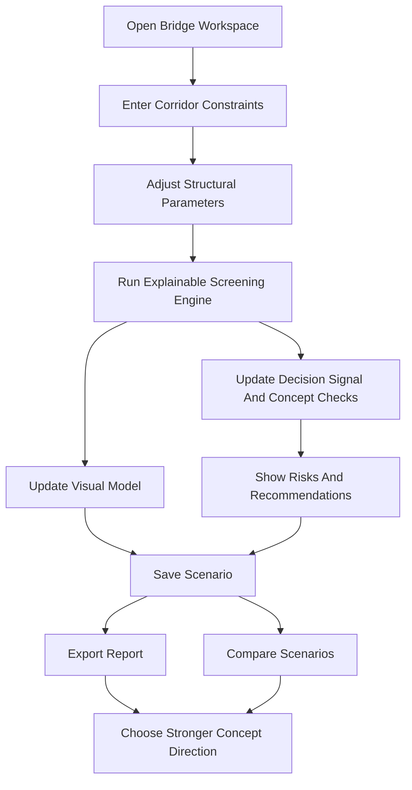
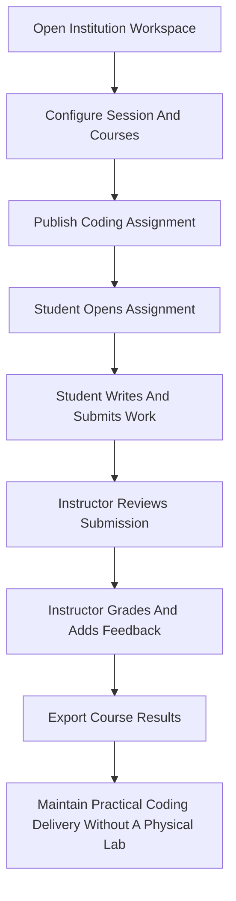

## 1. Product Overview
KARRAS is a modular platform for technical problem-solving tools.

- Some modules are **simulation / decision-support** products that help users test constrained systems before acting on them.
- Some modules are **operational / workflow** products that help users run critical technical processes when physical or institutional infrastructure is missing, weak, or inefficient.
- The current MVP proves this platform direction through two module types:
  - **Bridge Feasibility** as a simulation module
  - **Virtual Lab** as an operational module

The product targets planners, consultants, departments, instructors, students, researchers, and technical teams who need tools that are explainable, credible, and practically useful.

## 2. Module Portfolio

### 2.1 Simulation / Decision-Support Modules

#### Bridge Feasibility

Purpose:
- test concept-stage bridge crossing feasibility under waterway, structural, and basis constraints
- help users compare options before detailed engineering work begins

Core value:
- real-time constraint adjustment
- explainable screening checks
- scenario comparison and reporting

### 2.2 Operational / Workflow Modules

#### Virtual Lab

Purpose:
- enable institutions to run practical coding coursework without depending on a functioning physical computer lab

Core value:
- mobile-first student access
- institution-scoped course and assignment workflow
- grading and result export

## 3. User Roles

| Role | Module Context | Core Permissions |
|------|----------------|------------------|
| Analyst User | Bridge Feasibility | Create studies, adjust planning variables, compare options, export reports |
| Institution Admin | Virtual Lab | Configure institution workspace, manage academic structure, manage access and exports |
| Instructor / Staff | Virtual Lab | Publish assignments, review submissions, grade work, export results |
| Student / Learner | Virtual Lab | Access assignments, write and submit code, view grades and feedback |

## 4. Core Product Surfaces

### 4.1 Shared Platform Surfaces

1. **Module Launcher**: entry surface for choosing Bridge Feasibility or Virtual Lab
2. **Methodology View**: explains platform boundaries, module types, and model assumptions
3. **Authentication View**: account access and persistence

### 4.2 Bridge Feasibility Surfaces

1. **Workspace Page**: simulation canvas, planner controls, concept checks, scenario save, export, and compare
2. **Scenario Comparison View**: side-by-side trade-off analysis for saved options with basis-aware messaging
3. **Reports View**: decision signal, concept checks, provenance, and export flow

### 4.3 Virtual Lab Surfaces

1. **Institution Dashboard**: institution, session, and course overview
2. **Course Workspace**: assignments, roster, and grading state for a course
3. **Assignment Builder**: create and publish coding assignments
4. **Student Coding Workspace**: mobile-first assignment reading, code entry, and submission
5. **Grading Console**: review submissions, assign grades, leave comments
6. **Export Center**: export grade results by course or term

## 5. Page Details

| Page Name | Module Name | Feature description |
|-----------|-------------|---------------------|
| Module Launcher | Shared Platform | Present KARRAS as a multi-module platform with simulation and operational tools |
| Workspace Page | Bridge Feasibility | Set waterway, span, support, material, alignment, and study-basis parameters |
| Workspace Page | Bridge Canvas | Visualize the corridor, structural placement, and concept-state changes as inputs update |
| Workspace Page | Decision Panel | Display decision signal, study basis, concept checks, risks, and recommendations |
| Reports View | Bridge Feasibility | Show decision narrative, provenance, concept checks, and export-ready summary |
| Comparison View | Bridge Feasibility | Compare several bridge studies while keeping study basis and evidence mix visible |
| Institution Dashboard | Virtual Lab | Show institution branding, academic session, course activity, and grading status |
| Course Workspace | Virtual Lab | Organize course assignments, student roster, and course-level progress |
| Assignment Builder | Virtual Lab | Create practical coding tasks with instructions, deadlines, and publishing state |
| Student Coding Workspace | Virtual Lab | Let students read prompts, write code, save progress, and submit work from phones or laptops |
| Grading Console | Virtual Lab | Review submissions, assign grades, leave comments, and track grading completion |
| Export Center | Virtual Lab | Export grade records and submission outcomes for institutional use |
| Methodology View | Shared Platform | Explain module boundaries, simulation assumptions, and operational scope |
| Authentication View | Shared Platform | Register or sign in to persist work and institution access |

## 6. Core Processes

### 6.1 Bridge Feasibility Flow

The user opens the bridge workspace, defines corridor constraints, and adjusts structural choices. The simulation engine recalculates immediately, updating the visual model, decision signal, concept checks, warnings, and recommendations. The user saves multiple options, exports a report summary, and compares them side by side.

### 6.2 Virtual Lab Flow

An institution sets up its workspace, organizes courses for a term, and publishes coding assignments. Students access the platform on phones or laptops, complete submissions, and send work through the coding workspace. Staff review submissions, grade them, and export results for institutional use.

## 7. Design Direction

### 7.1 Platform Design Style

- Primary colors: graphite black, steel blue, oxidized teal, signal amber, and failure red
- Button style: precise technical controls with restrained luminous state accents
- Typography: distinctive headings with highly readable body text and strong data hierarchy
- Icon style: technical line icons and modular system cues

### 7.2 Bridge Module UX

- desktop-first planning cockpit
- large corridor canvas
- docked applets for controls, analysis, and study library
- provenance-forward reporting and comparison surfaces

### 7.3 Virtual Lab UX

- mobile-first student experience
- dashboard-driven staff and admin surfaces
- clean academic workflow states: draft, published, submitted, graded, exported
- institution identity visible across course and grading flows

### 7.4 Responsiveness

- Bridge Feasibility remains desktop-first because precision review and comparison matter most there
- Virtual Lab must be mobile-first on the student side while remaining comfortable on larger screens
- Staff and admin surfaces should adapt to tablet and desktop layouts without hiding core workflow context

## 8. MVP Boundaries

### 8.1 What The MVP Proves

- KARRAS can host both simulation and operational modules inside one coherent platform
- Bridge Feasibility can provide credible concept-stage screening with explainable checks and basis-aware reporting
- Virtual Lab can provide institution-ready assignment, submission, grading, and export workflows for practical coding delivery

### 8.2 What The MVP Does Not Yet Prove

- certified engineering analysis
- production-scale execution sandboxing
- complete LMS replacement
- advanced automated grading intelligence
- enterprise collaboration and governance depth
