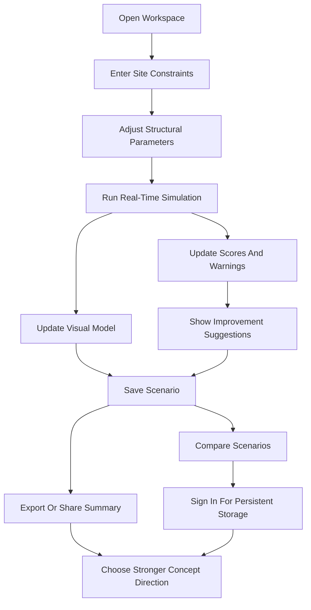

## 1. Product Overview
KARRAS is a simulation-based decision-support platform that helps users test how infrastructure constraints affect feasibility before detailed engineering work begins.
- The MVP proves a real-time input -> simulation -> visual feedback -> comparison workflow using a single infrastructure feasibility scenario.
- The product targets early-stage planners, consultants, students, researchers, and technical teams who need fast scenario exploration instead of spreadsheet guesswork.

## 2. Core Features

### 2.1 User Roles
| Role | Registration Method | Core Permissions |
|------|---------------------|------------------|
| Analyst User | Local session for MVP | Create scenarios, adjust variables, run simulations, compare saved options |

### 2.2 Feature Module
1. **Workspace Page**: simulation canvas, richer parameter controls, live metrics, scenario save, export, and compare
2. **Scenario Comparison View**: side-by-side trade-off analysis for saved options with delta summaries
3. **Methodology and Assumptions View**: explains model boundaries, scoring logic, and non-certification disclaimer
4. **Authentication View**: register, sign in, and connect local scenario work to persistent storage

### 2.3 Page Details
| Page Name | Module Name | Feature description |
|-----------|-------------|---------------------|
| Workspace Page | Constraint Builder | Set span distance, terrain type, terrain severity, load level, wind exposure, seismic demand, and environmental difficulty |
| Workspace Page | Structural Controls | Adjust support count, support spacing bias, material class, deck profile, foundation strategy, alignment strategy, and safety preference |
| Workspace Page | Simulation Canvas | Visualize terrain, structural span, support placement, live load position, stress zones, and state changes as inputs update |
| Workspace Page | Decision Panel | Display feasibility score, stability score, cost band, complexity score, and confidence label |
| Workspace Page | Failure Explanation | Show why a scenario is weak, what variable causes the issue, and which adjustments improve outcomes |
| Workspace Page | Scenario Tray | Save named scenarios, duplicate, delete, export, share summary, and promote one as a comparison baseline |
| Scenario Comparison View | Trade-off Comparison | Compare two or more saved scenarios across feasibility, stability, cost, complexity, and recommended action |
| Scenario Comparison View | Delta Insights | Highlight what changed between scenarios and why one option outperforms another |
| Methodology and Assumptions View | Model Boundaries | Explain that the MVP is a concept-stage feasibility model, not engineering approval software |
| Methodology and Assumptions View | Scoring Logic Overview | Describe rule-based scoring categories and how penalties or bonuses are applied |
| Authentication View | Account Access | Register or sign in to persist scenarios beyond the current browser session |
| Authentication View | Cloud Sync Status | Show whether local scenarios are unsynced, synced, or ready to publish into reports |

## 3. Core Process
The user opens the workspace, defines the site constraints, and adjusts structural choices. The simulation engine recalculates immediately, updating visuals, scores, warnings, and guidance. The user saves multiple options, exports or shares a report summary, compares them side by side, and can sign in so scenarios persist across sessions and devices.

## 4. User Interface Design
### 4.1 Design Style
- Primary colors: graphite black, steel blue, oxidized teal, signal amber, and failure red
- Button style: sharp-edged industrial controls with subtle elevation and luminous state accents
- Font and sizes: a distinctive display serif or engineered grotesk for headings paired with a refined readable body font; large dashboard numerics for key metrics
- Layout style: desktop-first split workspace with left-side controls, center visualization, right-side decision panel, and a persistent bottom comparison tray
- Icon style suggestions: technical line icons, structural diagram motifs, grid overlays, and restrained data-display glyphs

### 4.2 Page Design Overview
| Page Name | Module Name | UI Elements |
|-----------|-------------|-------------|
| Workspace Page | Constraint Builder | Dense but elegant control stack, segmented selectors, calibrated sliders, inline metric tags, and scenario sensitivity hints |
| Workspace Page | Simulation Canvas | Dark atmospheric terrain field, layered depth grid, animated structure overlay, risk heat zones, load-position sweep, and spotlight inspection modes |
| Workspace Page | Decision Panel | Score cards, radial indicators, severity badges, recommendation blocks, expandable explanation drawer, and export actions |
| Workspace Page | Scenario Tray | Named tiles, mini sparklines, snapshot thumbnails, active baseline highlighting, and report/share controls |
| Scenario Comparison View | Trade-off Comparison | Large comparison table, animated delta bars, weighted-score summary, recommended option banner |
| Methodology and Assumptions View | Model Boundaries | Editorial content layout, diagrams, rule examples, and disclaimer blocks |
| Authentication View | Account Access | Dark industrial access panel, trust messaging, session state chip, and cloud-sync explanation |

### 4.3 Responsiveness
Desktop-first layout is the default. Tablet view collapses the right-side decision panel into stacked sections and keeps the comparison tray scrollable. Mobile adaptation is secondary for the MVP and should prioritize parameter review, result inspection, and scenario comparison rather than full precision editing.

### 4.4 3D Scene Guidance
- Environment and mood: dark technical studio with a terrain board feel rather than photorealistic construction imagery
- Lighting setup: low-key environment lighting with bright directional accents on the active structure and constraints
- Camera settings and motion: shallow perspective with slow parallax and smooth interpolation during parameter changes
- Composition and focal elements: terrain base, span line, supports, load markers, and failure hotspots form the main visual hierarchy
- Interactions and animations: slider edits trigger support shifts, span tension feedback, warning pulses, and metric transitions
- Post-processing effects: restrained bloom, ambient occlusion, thin grid fog, and selective highlights on critical risk areas
- Asset sources and performance budgets: procedural shapes and SVG-first overlays are preferred; keep the scene lightweight enough for fluid interaction on standard laptops
