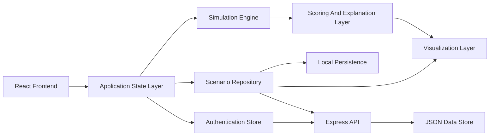
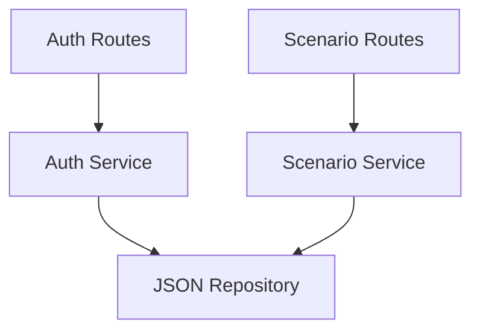
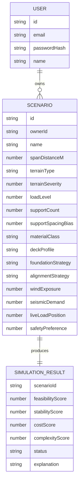

## 1. Architecture Design


## 2. Technology Description
- Frontend: React@18 + TypeScript + Vite + Tailwind CSS v3
- Backend: Express + TypeScript running in the `api` directory
- State Management: Zustand for scenario state, UI state, and simulation results
- Visualization: SVG-first rendering with optional canvas enhancement for animated structural feedback
- Motion: Framer Motion for panel transitions, metric animations, and comparison interactions
- Persistence: browser localStorage for MVP scenario persistence
- Persistent Storage: file-based JSON store for authenticated scenarios in the first backend-enabled phase
- Testing: Vitest + React Testing Library for simulation rules and critical UI workflows
- Initialization Tool: Vite

## 3. Route Definitions
| Route | Purpose |
|-------|---------|
| / | Main simulation workspace with real-time input and visual feedback |
| /compare | Compare saved scenarios across multiple metrics |
| /methodology | Explain assumptions, scoring rules, and MVP boundaries |
| /auth | Register and sign in to enable persistent scenario storage |

## 4. API Definitions
The expanded MVP keeps simulation logic client-side for responsiveness while introducing a lightweight backend for account access and persistent scenario storage.

### Type Definitions
```ts
type TerrainType = "flat" | "rocky" | "wetland" | "valley";

type MaterialClass = "steel" | "reinforced-concrete" | "composite";

type DeckProfile = "light" | "standard" | "heavy-duty";

type FoundationStrategy = "shallow" | "deep-pile" | "caisson";

type AlignmentStrategy = "direct" | "offset" | "stepped";

type ScenarioInput = {
  id: string;
  name: string;
  spanDistanceM: number;
  terrainType: TerrainType;
  terrainSeverity: number;
  loadLevel: number;
  supportCount: number;
  supportSpacingBias: number;
  materialClass: MaterialClass;
  deckProfile: DeckProfile;
  foundationStrategy: FoundationStrategy;
  alignmentStrategy: AlignmentStrategy;
  windExposure: number;
  seismicDemand: number;
  liveLoadPosition: number;
  safetyPreference: number;
};

type SimulationResult = {
  feasibilityScore: number;
  stabilityScore: number;
  costScore: number;
  complexityScore: number;
  status: "viable" | "borderline" | "high-risk" | "failed";
  dominantRisks: string[];
  recommendations: string[];
  explanation: string;
};

type AuthUser = {
  id: string;
  email: string;
  name: string;
};

type AuthResponse = {
  token: string;
  user: AuthUser;
};
```

### Endpoints
```ts
POST /api/auth/register
POST /api/auth/login
GET /api/auth/me
GET /api/scenarios
POST /api/scenarios
PUT /api/scenarios/:id
DELETE /api/scenarios/:id
```

## 5. Server Architecture Diagram


## 6. Data Model
### 6.1 Data Model Definition


### 6.2 Data Definition Language
The frontend keeps a local cache while the backend stores authenticated accounts and cloud scenarios in JSON:

```ts
type ScenarioStore = {
  scenarios: ScenarioInput[];
  resultsByScenarioId: Record<string, SimulationResult>;
  selectedScenarioId: string | null;
  comparisonScenarioIds: string[];
  syncState: "local-only" | "syncing" | "synced";
};
```

## 7. Implementation Notes
- Use a domain-first folder structure with `simulation`, `visualization`, `scenarios`, `comparison`, and `methodology` modules separated from shared UI primitives.
- Keep the simulation engine deterministic and explainable. Use weighted rules, thresholds, and penalties instead of opaque AI logic in the MVP.
- Separate `input normalization`, `derived metric calculation`, `score aggregation`, and `recommendation generation` into pure functions so the engine remains testable and portable to future scenario types.
- Maintain a scenario schema that can later support roads, traffic, and capacity planning modules through adapter layers rather than rewriting core state infrastructure.
- Build the workspace as a premium desktop application feel: large canvas, high-contrast metric panels, fast transitions, drag-aware interaction zones, and strong information hierarchy.
