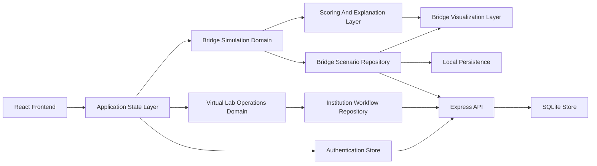
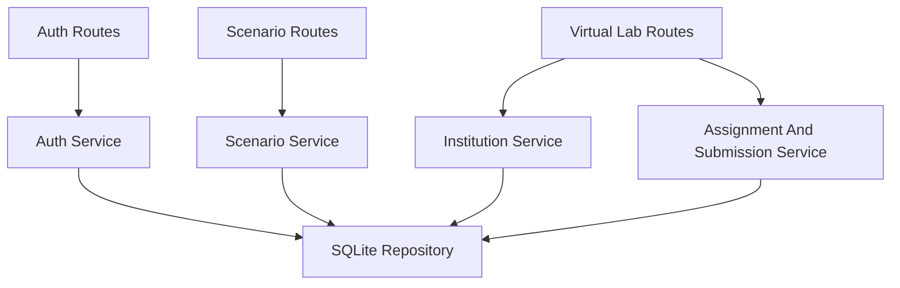
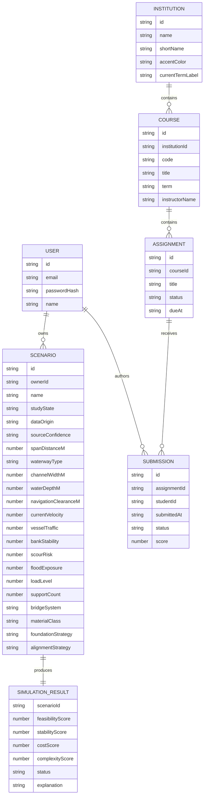

## 1. Architecture Design



## 2. Technology Description

* Frontend: React\@18 + TypeScript + Vite + Tailwind CSS v3

* Backend: Express + TypeScript running in the `api` directory

* State Management: Zustand for shared UI state, bridge scenario state, and future virtual lab workflow state

* Visualization: SVG-first rendering for the bridge workspace and responsive dashboard surfaces for Virtual Lab

* Motion: Framer Motion for panel transitions, metric animations, and comparison interactions

* Persistence: browser localStorage for bridge scenario persistence and lightweight client cache where appropriate

* Persistent Storage: SQLite-backed backend storage for authenticated bridge and virtual lab data

* Testing: Vitest + React Testing Library for simulation rules and critical UI workflows

* Initialization Tool: Vite

## 3. Route Definitions

| Route                         | Purpose                                                              |
| ----------------------------- | -------------------------------------------------------------------- |
| /                             | Module launcher and platform home                                    |
| /workspace                    | Bridge simulation workspace with real-time input and visual feedback |
| /reports                      | Bridge reporting surface                                             |
| /compare                      | Compare saved bridge scenarios across multiple metrics               |
| /virtual-lab                  | Virtual Lab institution dashboard                                    |
| /virtual-lab/course/:courseId | Course workspace with assignments and roster context                 |
| /virtual-lab/student          | Student assignment and coding workspace                              |
| /virtual-lab/grading          | Staff grading console                                                |
| /methodology                  | Explain module types, assumptions, scoring rules, and MVP boundaries |
| /auth                         | Register and sign in to enable persistent scenario storage           |

## 4. API Definitions

The expanded MVP keeps bridge simulation logic client-side for responsiveness while introducing a lightweight backend for account access, persistent scenario storage, and the Virtual Lab workflow domain.

### Type Definitions

```ts
type ScenarioInput = {
  id: string;
  name: string;
  studyState: "blank-canvas" | "configured";
  dataOrigin: "curated-preset" | "manual-estimate" | "user-import";
  sourceConfidence: "sample-curated" | "manual-estimate" | "imported-user-data";
  waterwayType: "river" | "lagoon" | "harbor" | "delta";
  spanDistanceM: number;
  channelWidthM: number;
  waterDepthM: number;
  navigationClearanceM: number;
  currentVelocity: number;
  vesselTraffic: number;
  bankStability: number;
  scourRisk: number;
  floodExposure: number;
  loadLevel: number;
  supportCount: number;
  bridgeSystem: "girder" | "truss" | "arch" | "cable-stayed";
  materialClass: "steel" | "reinforced-concrete" | "composite";
  foundationStrategy: "shallow" | "deep-pile" | "caisson";
  alignmentStrategy: "direct" | "offset" | "stepped";
};

type SimulationResult = {
  feasibilityScore: number;
  stabilityScore: number;
  costScore: number;
  complexityScore: number;
  confidenceLabel: string;
  decisionSignal: string;
  basisNote: string;
  status: "viable" | "borderline" | "high-risk" | "failed";
  dominantRisks: string[];
  recommendations: string[];
  explanation: string;
};

type Institution = {
  id: string;
  name: string;
  shortName: string;
  accentColor: string;
  currentTermLabel: string;
};

type Course = {
  id: string;
  institutionId: string;
  code: string;
  title: string;
  term: string;
  instructorName: string;
  studentCount: number;
};

type Assignment = {
  id: string;
  courseId: string;
  title: string;
  prompt: string;
  status: "draft" | "published" | "closed";
  dueAt: string;
};

type Submission = {
  id: string;
  assignmentId: string;
  studentId: string;
  studentName: string;
  submittedAt: string | null;
  status: "draft" | "submitted" | "graded";
  score: number | null;
};

type AuthUser = {
  id: string;
  email: string;
  name: string;
};

type AuthResponse = {
  token: string;
  user: AuthUser;
};
```

### Endpoints

```ts
POST /api/auth/register
POST /api/auth/login
GET /api/auth/me

GET /api/scenarios
POST /api/scenarios
PUT /api/scenarios/:id
DELETE /api/scenarios/:id

GET /api/institutions/:id
GET /api/institutions/:id/courses
GET /api/courses/:id/assignments
POST /api/courses/:id/assignments
GET /api/assignments/:id/submissions
POST /api/assignments/:id/submissions
PUT /api/submissions/:id/grade
GET /api/courses/:id/export
```

## 5. Server Architecture Diagram



## 6. Data Model

### 6.1 Data Model Definition



### 6.2 Data Definition Language

The frontend keeps a local cache while the backend stores authenticated accounts, bridge scenarios, and virtual lab workflow data in SQLite:

```ts
type ScenarioStore = {
  scenarios: ScenarioInput[];
  resultsByScenarioId: Record<string, SimulationResult>;
  selectedScenarioId: string | null;
  comparisonScenarioIds: string[];
  syncState: "local-only" | "syncing" | "synced";
};

type VirtualLabStore = {
  institution: Institution | null;
  courses: Course[];
  assignmentsByCourseId: Record<string, Assignment[]>;
  submissionsByAssignmentId: Record<string, Submission[]>;
  activeCourseId: string | null;
  activeAssignmentId: string | null;
};
```

## 7. Implementation Notes

* Use a domain-first folder structure with `simulation`, `virtual-lab`, `comparison`, `reporting`, and `methodology` modules separated from shared UI primitives.

* Keep the bridge simulation engine deterministic and explainable. Use weighted rules, thresholds, and explicit screening checks instead of opaque AI logic in the MVP.

* Keep Virtual Lab as a distinct workflow domain rather than forcing its data model into the bridge scenario schema.

* Separate bridge `input normalization`, `derived metric calculation`, `screening logic`, and `recommendation generation` into pure functions so the engine remains testable and portable.

* Build the bridge workspace as a premium desktop planning cockpit and the Virtual Lab student experience as a strongly mobile-first workflow surface.

